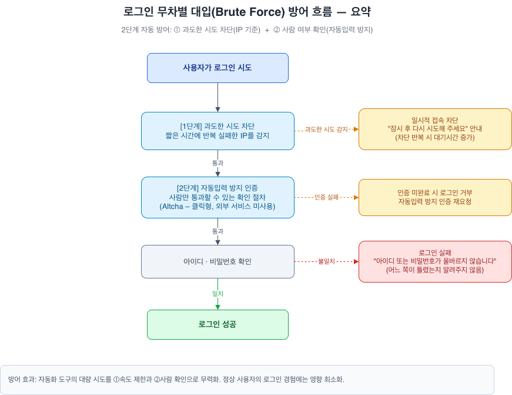
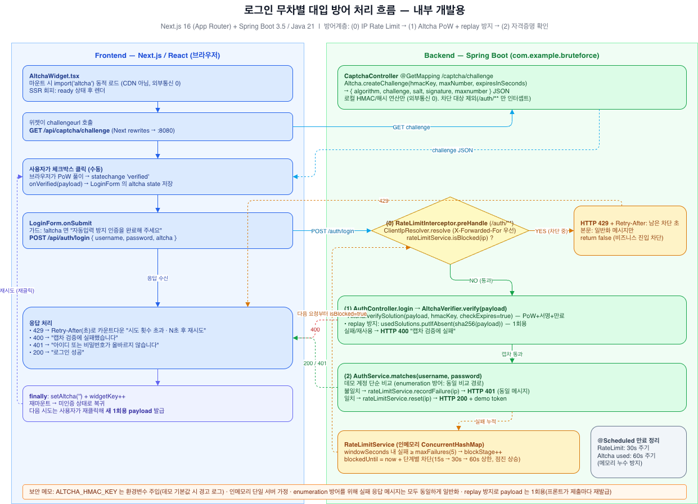

# 무차별 대입(Brute Force) 방어 예시

구현:
- Frontend: Next.js
- Backend: Spring Boot

2계층 브루트포스 방어 예시 모노레포입니다.

- **1계층 — IP Rate Limit**: 로그인 실패가 임계치를 넘으면 IP를 점진적으로 차단하고
  `HTTP 429 + Retry-After`(남은 초)를 반환 → 프론트가 매초 갱신되는 카운트다운 표시
- **2계층 — Altcha PoW**: 로그인 폼 앞단에 Proof-of-Work 챌린지를 두어 자동화 비용을
  높이고, 백엔드가 PoW 검증 + 1회용(replay) 처리

설계 근거:
- [`checkup-backend-rate-limit.md`](./checkup-backend-rate-limit.md),
- [`checkup-altcha-pilot.md`](checkup-altcha-pilot.md)

```
altcha-exam/
├── backend/   # Spring Boot 3.5 / Java 21 / Gradle
└── frontend/  # Next.js 16 (App Router) / TypeScript
```

## 처리 흐름

대략적인 흐름:


세부 흐름:


## 사전 요구

- JDK 21+
- Node 22+

## 실행

```bash
# 1) 백엔드 (포트 8080)
cd backend
./gradlew bootRun

# 2) 프론트엔드 (포트 3000) — 새 터미널
cd frontend
npm install
npm run dev
```

브라우저에서 http://localhost:3000 접속.

- 프론트의 `/api/*` 요청은 `next.config.js`의 `rewrites`로 백엔드(`:8080`)에 프록시됩니다.
  (동일 출처 → CORS 불필요 + `Retry-After` 헤더 그대로 전달)

## 데모 계정 / 임계치

| 항목 | 값 |
|---|---|
| 유효 계정 | `demo` / `password123` |
| 실패 카운팅 윈도우 | 60초 |
| 차단 임계 | 윈도우 내 **5회 실패** |
| 점진적 차단 | 1단계 15초 → 2단계 30초 → 3단계+ 60초(상한) |

> 데모 체감을 위해 초단위 값을 사용합니다. 운영 권장값(10분/10회·5·15·30분)은
> `backend/src/main/resources/application.yml` 주석과 설계 문서를 참고하세요.

## 동작 확인 (기대결과)

1. 위젯이 자동으로 PoW를 풀면 **로그인** 버튼 활성화
2. 틀린 비밀번호로 **5회 실패** → 6번째부터 화면에 **“N초 후 재시도 가능”**이
   **매초 감소**하며 폼이 잠김 → 0이 되면 자동 해제
3. `demo` / `password123` 입력 시 로그인 성공

## 환경변수

| 변수 | 설명 |
|---|---|
| `ALTCHA_HMAC_KEY` | Altcha HMAC 서명 키. 미설정 시 데모 기본값 사용(경고 로그). **운영에서는 반드시 환경변수로 교체** |
| `BACKEND_URL` | (프론트) 프록시 대상 백엔드 URL. 기본 `http://localhost:8080` |

## 방어 흐름 (`POST /auth/login`)

```
요청 → [IP 차단 중?] ─ YES → 429 + Retry-After(초)
              │ NO
              ▼
        [Altcha PoW 검증 + replay 방지] ─ 실패 → 400
              │ 통과
              ▼
        [자격증명 일치?] ─ 실패 → 실패 카운트++ → 401(동일 일반 메시지)
              │ 성공
              ▼
        카운터 리셋 → 200 (데모 토큰)
```

## 범위 / 주의

- **인메모리 · 서버 1대 전제** (Redis/DB 없음). 재시작 시 카운터·replay 기록 소멸 — 데모 허용
- 세션/JWT 발급은 데모 메시지로 대체
- enumeration 방어: 실패 시 어느 필드가 틀렸는지 노출하지 않는 동일 메시지
- 식별자(ID)별 시도 제한·화이트리스트·로깅 모니터링 등은 설계 문서의 추가 권장사항 참고
- OSS 고지: `altcha`(MIT), `org.altcha:altcha`(MIT)
